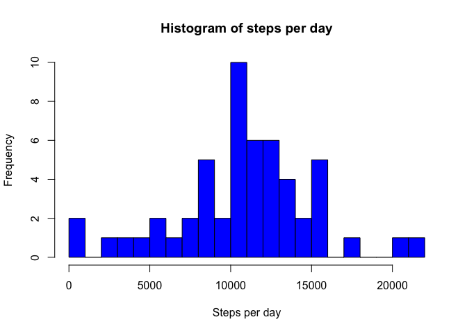
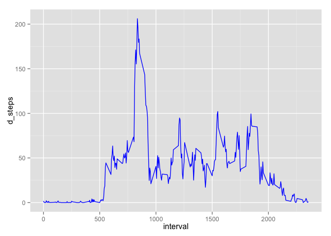
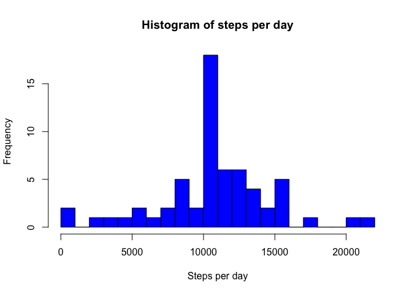
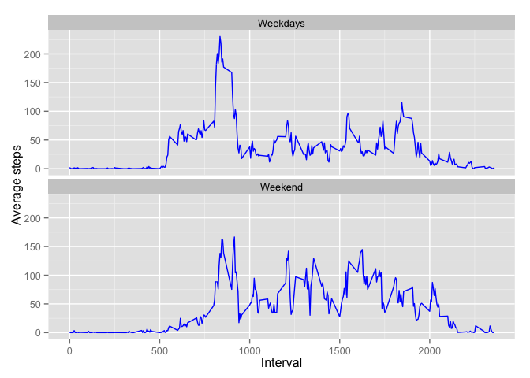

# Reproducible Research: Peer Assessment 1


## Introduction
This assignment makes use of data from a personal activity monitoring device. This device collects data at 5 minute intervals through out the day. The data consists of two months of data from an anonymous individual collected during the months of October and November, 2012 and include the number of steps taken in 5 minute intervals each day.

## Data
The data for this assignment can be downloaded from the course web site:

Dataset: Activity monitoring data [52K]
The variables included in this dataset are:

- steps: Number of steps taking in a 5-minute interval (missing values are coded as NA)

- date: The date on which the measurement was taken in YYYY-MM-DD format

- interval: Identifier for the 5-minute interval in which measurement was taken

- The dataset is stored in a comma-separated-value (CSV) file and there are a total of 17,568 observations in this dataset.

## R Preparation

```r
library(dplyr)
```

```
## 
## Attaching package: 'dplyr'
## 
## The following objects are masked from 'package:stats':
## 
##     filter, lag
## 
## The following objects are masked from 'package:base':
## 
##     intersect, setdiff, setequal, union
```

```r
library(ggplot2)
library(lubridate)
library(timeDate)
```
## Loading and preprocessing the data
Show any code that is needed to:

1.Load the data (i.e. read.csv() )
Assuming the file already exist in the working directory

```r
data_file <- read.csv("activity.csv", header = TRUE, sep = ",")
```
2.Process/transform the data (if necessary) into a format suitable for your analysis.
Changing the date format using lubridate()

```r
data_file$date <- ymd(data_file$date)
data_file$steps <- as.numeric(data_file$steps)
```
Preparing a data frame without NA

```r
proc_data <- filter(data_file, !is.na(steps))
```

## What is mean total number of steps taken per day?
For this part of the assignment the missing values can be ignored.

1.Calculate the total number of steps taken per day.

```r
total_steps <- proc_data %>% group_by(date) %>% summarise(steps = sum(steps))
```

2.Make a histogram of the total number of steps taken each day.

```r
hist(total_steps$steps,
     main = "Histogram of steps per day", 
     xlab = "Steps per day", 
     ylab = "Frequency",
     breaks=20,  col = "blue")
```

 

3.Calculate and report the mean and median of the total number of steps taken per day.

```r
mean_total_steps <- mean(total_steps$steps)
median_total_steps <- median(total_steps$steps)
```
- Mean

```r
mean_total_steps
```

```
## [1] 10766.19
```
- Median

```r
median_total_steps
```

```
## [1] 10765
```

The mean steps is 10766 and median steps is 10765

## What is the average daily activity pattern?
1.Make a time series plot (i.e. type = "l") of the 5-minute interval (x-axis) and the average number of steps taken, averaged across all days (y-axis).

```r
daily_pattern <- proc_data %>% group_by(interval) %>% summarize(d_steps = mean(steps))
```
Ploting the series

```r
ggplot(daily_pattern, aes(x=interval, y=d_steps)) + geom_line(color = "blue") +
      xlab("Interval") +
      ylab(" Average steps")
```

 

2.Which 5-minute interval, on average across all the days in the dataset, contains the maximum number of steps?

```r
max_step_int <- filter(daily_pattern, d_steps == max(d_steps))
max_step_int$interval
```

```
## [1] 835
```
The 5-Minutes Interval that contain the maximum numbers of steps is 835

## Imputing missing values
Note that there are a number of days/intervals where there are missing values (coded as NA). The presence of missing days may introduce bias into some calculations or summaries of the data.

1.Calculate and report the total number of missing values in the dataset (i.e. the total number of rows with NAs).

```r
sum(is.na(data_file$steps)) 
```

```
## [1] 2304
```
2.Devise a strategy for filling in all of the missing values in the dataset. The strategy does not need to be sophisticated. For example, you could use the mean/median for that day, or the mean for that 5-minute interval, etc.

Since the grouping by days is revealing that some days are completely unsuable for that purpose, the already calculated data frame with the average interval can be reused.

```r
full_data <- inner_join(data_file, daily_pattern, by="interval") %>% 
      mutate(steps = ifelse(is.na(steps),d_steps,steps))
```
Validation of the inner_join()

```r
sum(is.na(full_data))
```

```
## [1] 0
```

```r
head(full_data)
```

```
##       steps       date interval   d_steps
## 1 1.7169811 2012-10-01        0 1.7169811
## 2 0.3396226 2012-10-01        5 0.3396226
## 3 0.1320755 2012-10-01       10 0.1320755
## 4 0.1509434 2012-10-01       15 0.1509434
## 5 0.0754717 2012-10-01       20 0.0754717
## 6 2.0943396 2012-10-01       25 2.0943396
```
3.Create a new dataset that is equal to the original dataset but with the missing data filled in.

```r
full_total_steps <- full_data %>% group_by(date) %>% summarise(steps = sum(steps))
```

4.Make a histogram of the total number of steps taken each day and calculate and report the mean and median total number of steps taken per day. Do these values differ from the estimates from the first part of the assignment? What is the impact of imputing missing data on the estimates of the total daily number of steps?

```r
hist(full_total_steps$steps,
     main = "Histogram of steps per day", 
     xlab = "Steps per day", 
     ylab = "Frequency",
     breaks=20,  col = "blue")
```

 

```r
mean_total_steps_full <- mean(full_total_steps$steps)
median_total_steps_full <- median(full_total_steps$steps)
```
- Mean

```r
mean_total_steps_full
```

```
## [1] 10766.19
```
- Median

```r
median_total_steps_full
```

```
## [1] 10766.19
```
The impact of filling missing data with the average number of steps in the same 5-min interval is that both the mean and the median are equal to the same value: 10766.

## Are there differences in activity patterns between weekdays and weekends?
1.Create a new factor variable in the dataset with two levels - "weekday" and "weekend" indicating whether a given date is a weekday or weekend day.
Identifying which date is a week day or a weekend day with timeDate()

```r
full_data$daystype <- ifelse((isWeekday(data_file$date, wday=1:5)),"Weekdays", "Weekend")
head(full_data)
```

```
##       steps       date interval   d_steps daystype
## 1 1.7169811 2012-10-01        0 1.7169811 Weekdays
## 2 0.3396226 2012-10-01        5 0.3396226 Weekdays
## 3 0.1320755 2012-10-01       10 0.1320755 Weekdays
## 4 0.1509434 2012-10-01       15 0.1509434 Weekdays
## 5 0.0754717 2012-10-01       20 0.0754717 Weekdays
## 6 2.0943396 2012-10-01       25 2.0943396 Weekdays
```
Create a new data frame group by the new variable and the interval

```r
act_pattern <- full_data %>% group_by(daystype,interval) %>% summarize(steps=mean(steps))
```

2.Make a panel plot containing a time series plot (i.e. type = "l") of the 5-minute interval (x-axis) and the average number of steps taken, averaged across all weekday days or weekend days (y-axis).

```r
ggplot(act_pattern, aes(x=interval, y=steps, daystype)) +
      geom_line(colour="blue") +
      xlab("Interval") +
      ylab("Average steps") +
      facet_wrap(~daystype, ncol = 1, nrow=2)
```

 

